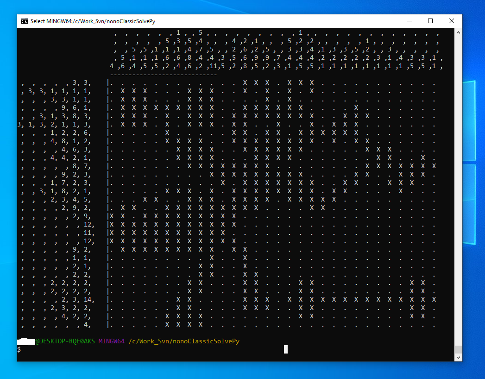

# nonogramClassicSolver
NonoGram classic solver puzzle solving:  Motivated by insights of my experience for solving the puzzle, the algorithm applies a set of rules iteratively on the puzzle board. The solution process is gradual and iterative, where at each step, one can find pixels in the grid that can be “marked” (or darkened) or “blanked” out (using dot marking).  Eventually after marking enough pixels the hidden picture of the puzzle reveals itself to our great satisfaction. 


## Usage:

1. ```nonoClassicSolver.py [input file (csv)]```

   if no file is specified the default input is: 'nonoQuiz-big-bug.csv', see example file for format.
   Currently, at each step the solver waits for user input. This, can be changed by setting the 
   puzzleState.waitOnStep = False 
   
2. ```nonoSolverRecursive.py [-h] [--qfile QFile] [--depth DEPTH]```
                          ```[--basepath BASEPATH] [--qdir QDIR]```
                          ```[--ddir DDIR] [--gen N] [--gen-dim DIM]```
                          
                         
                          
   The recursive tool searches for "as many" nonoGrams solutions possible (with an adjustable limit), the nono-grams that are found to have a single-solution are copied from the input directory to a destination path. There is also an option to generate random puzzles and then the run the tool to solve/sort them.
 
   The recursive tool expects that the quiz files would be in the "--qdir' directory (which is under the
     basepath) and the single solution quizes will be copied to 'ddir' directory. Note, that in case where the '--gen' option is used then the specified number of random nonogram quizes are generated and stored in the `qdir` directory path.
    
     The quiz file names is expected to start with  'Q-'..'.csv' and the solution file
     name format 'QPic-'..'.csv'. 
     
    -Example of use:
    
     ```$python3 nonoSolverRecursive.py --basepath /home/foo/nonoGram/ --qdir nonoGramQuizes --ddir singleSolutionDir```
     
     ```$python3 nonoSolverRecursive.py --basepath /home/foo/nonoGram/ --qdir nonoGramQuizes --ddir singleSolutionDir --gen 1000 --gen-dim 20```
    
     ```$python3 nonoSolverRecursive.py --qfile /home/foo/nonoGram/Q-113.csv```


   First the recursive solver finds one or more possible solutions for nonoGrams using the nonoClassicSolver.solve(). In the case that no solution is found by the basic solver the recusive process continues a guess search to find more solutions.
    
